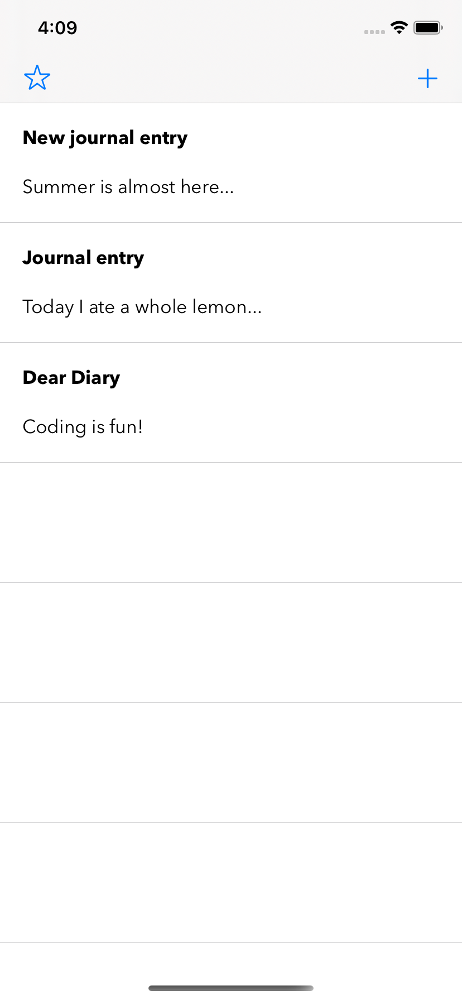

#  Journal App

## User enters in notes that can be favorited and filtered. Works with Firebase for a database.

### User selects a note, and a segue shows the note view controller with text field and text view to enter in data. User can save note, delete existing notes, or favorite a note.

## Google's Firebase holds all the data

